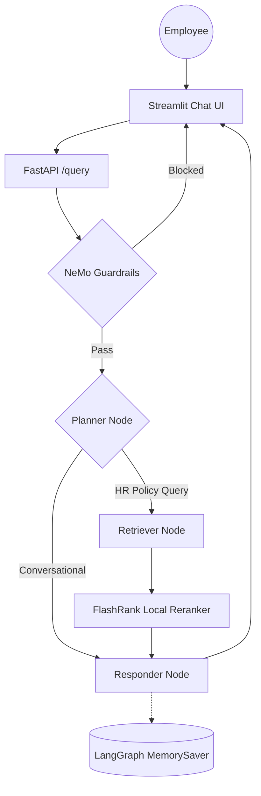

# Intelligent RAG — Zyro Dynamics HR Help Desk

An intelligent HR Help Desk chatbot using **RAG (Retrieval-Augmented Generation)** that answers employee HR queries accurately from Zyro Dynamics' internal policy documents. Built with **LangGraph**, **Portkey LLM Gateway**, **NeMo Guardrails**, and **RAGAS Evaluation Suite**.

## Key Features

- **Agentic Intelligence**: LangGraph for cyclic reasoning, multi-step planning, and conversation memory.
- **Guardrails**: NeMo Guardrails gate blocks off-topic, jailbreak, and injection inputs before any retrieval.
- **LLM Gateway**: Portkey routes all LLM calls with automatic fallback between primary and backup Groq keys.
- **HR Document Search**: Qdrant Cloud for high-performance vector search + FlashRank for local semantic reranking.
- **Embeddings**: Gemini `gemini-embedding-2-preview` (3072-dim) with `all-mpnet-base-v2` (768-dim) fallback.
- **Local Document Parsing**: 11 HR Policy PDFs parsed entirely on-device — no external OCR service.
- **Observability**: Full trace nesting with **Pydantic Logfire** and **LangSmith** across every agent node.
- **Evaluation Suite**: RAGAS-powered eval pipeline (6 metrics) with a dedicated Streamlit demo app.
- **Out-of-Scope Handling**: Graceful refusal for questions outside HR policy scope.

---

## Dataset

**11 HR Policy Documents** from Zyro Dynamics Pvt. Ltd. (`project-2-intelligent-rag/zyro-dynamics-hr-corpus`):

| # | Document | Policy Area |
|---|----------|-------------|
| 00 | Company Profile | Company overview, mission, values, grade structure |
| 01 | Employee Handbook | General employee guidelines |
| 02 | Leave Policy | Earned, sick, maternity, paternity, bereavement, marriage leave |
| 03 | Work From Home Policy | WFH eligibility, hybrid/remote arrangements |
| 04 | Code of Conduct | Professional conduct, gifts, conflicts of interest |
| 05 | Performance Review Policy | APR, PIP, OKR framework, promotions |
| 06 | Compensation & Benefits | Salary bands, insurance, ESOP, PF, gratuity |
| 07 | IT & Data Security Policy | Password rules, device usage, data handling |
| 08 | Prevention of Sexual Harassment | POSH guidelines, ICC, complaint process |
| 09 | Onboarding & Separation | Joining process, notice period, exit formalities |
| 10 | Travel & Expense Policy | Domestic/international allowances, reimbursement |

---

## Agent Intelligence Flow



---

## Project Structure

```text
├── app/
│   ├── agents/
│   │   └── nodes/       # Planner, Retriever, Responder LangGraph nodes
│   ├── gateway/         # Portkey LLM gateway — primary + fallback Groq routing
│   ├── guardrails/      # NeMo Guardrails — HR-domain off-topic/jailbreak filtering
│   ├── ingestion/
│   │   ├── chunking/    # Paragraph-based text splitter (1500 char max)
│   │   └── loaders/     # Local parsers — PDF (pypdf), HTML, TXT, DOCX, PPTX
│   ├── services/
│   │   └── retrieval/   # Embeddings + Qdrant search + FlashRank reranking
│   ├── evals/           # RAGAS evaluation suite + Streamlit 3-tab demo
│   ├── config.py        # Centralized environment variable management
│   └── main.py          # FastAPI entrypoint — guardrails gate + /query endpoint
├── ui/                  # Streamlit chat interface with reasoning step transparency
├── project-2-intelligent-rag/
│   ├── zyro-dynamics-hr-corpus/  # 11 HR Policy PDFs (source dataset)
│   ├── test.csv                  # 20 competition questions
│   └── sample submission.csv    # Submission format reference
├── processed_data/      # Auto-generated — parsed & chunked JSON output per document
├── generate_submission.py  # Reads test.csv, queries RAG, outputs submission.csv
└── requirements.txt     # Pinned dependencies
```

---

## Tech Stack

| Layer | Technology |
|-------|-----------|
| Orchestration | LangChain + LangGraph |
| LLMs | Groq (Llama 3.3 70B) via **Portkey** gateway |
| Guardrails | NeMo Guardrails (HR-domain Colang rules) |
| Vector DB | Qdrant Cloud |
| Reranking | FlashRank (local, zero-latency) |
| Embeddings | Gemini `gemini-embedding-2-preview` (3072-dim) / `all-mpnet-base-v2` (768-dim) fallback |
| Document Parsing | pypdf + pdfplumber (local, no OCR service) |
| Observability | Pydantic Logfire + LangSmith |
| Evaluation | RAGAS + custom Tool Correctness (Jaccard) |

---

## Getting Started

### 1. Install dependencies

```powershell
python -m venv .venv
.\.venv\Scripts\activate
pip install -r requirements.txt
```

### 2. Configure environment

Create a `.env` file with the following keys:

```env
# Groq Reasoning Engine (Llama 3.3)
GROQ_API_KEY = ""
GROQ_FALLBACK_API_KEY = ""          # second Groq key, or same as primary

# Portkey LLM Gateway
PORTKEY_API_KEY = ""

# Qdrant Vector DB
QDRANT_API_KEY = ""
QDRANT_CLUSTER_ENDPOINT = ""        # e.g. https://your-cluster.cloud.qdrant.io:6333

# Pydantic Logfire Observability
LOGFIRE_TOKEN = ""

# LangSmith
LANGSMITH_TRACING = true
LANGSMITH_ENDPOINT = https://api.smith.langchain.com
LANGSMITH_API_KEY = ""
LANGSMITH_PROJECT = ""

# Streamlit UI → FastAPI
BACKEND_URL = ""                    # e.g. http://localhost:8000

# Eval judge LLM (keep separate from main key to avoid rate-limiting the live app)
JUDGE_GROQ = ""

# Gemini Embeddings
GEMINI_API_KEY = ""
```

### 3. Run data ingestion

Parses all 11 HR Policy PDFs, chunks them, saves metadata to `processed_data/`, and indexes vectors into Qdrant.

```powershell
python -m app.ingestion.processor "project-2-intelligent-rag/zyro-dynamics-hr-corpus" hr_policy --wipe
```

> Pass `--wipe` to drop and recreate the Qdrant collection. Omit it to append to an existing collection.

### 4. Launch the app

```powershell
# Terminal 1 — FastAPI backend
uvicorn app.main:app --reload --port 8000

# Terminal 2 — Streamlit UI
streamlit run ui/app.py
```

### 5. Generate competition submission

```powershell
# Requires the FastAPI backend running on :8000
python generate_submission.py
```

This reads all 20 questions from `test.csv`, sends each to the `/query` endpoint, and writes `submission.csv`.

### 6. Run the eval suite (optional)

```powershell
# Requires the FastAPI backend running on :8000
streamlit run app/evals/app.py
```

---

## Evaluation

The golden dataset contains all **20 test questions** from the competition:
- **Q01–Q17**: In-scope HR policy questions (leave, compensation, performance, WFH, code of conduct, IT security, POSH, onboarding, travel, ESOP)
- **Q18–Q20**: Out-of-scope questions (revenue, competitor comparison, external company policy)

Plus **6 guardrail test cases** (jailbreak, off-topic, legitimate HR queries).

### Scoring
| Type | Points Each | Total |
|------|------------|-------|
| In-scope HR questions (Q01–Q17) | 5 pts | 75 pts |
| Out-of-scope refusal (Q18–Q20) | 5 pts | 25 pts |
| **Total** | | **100 pts** |

---

*Built for Gen AI Project 2: Intelligent RAG — Zyro Dynamics HR Help Desk Challenge.*
